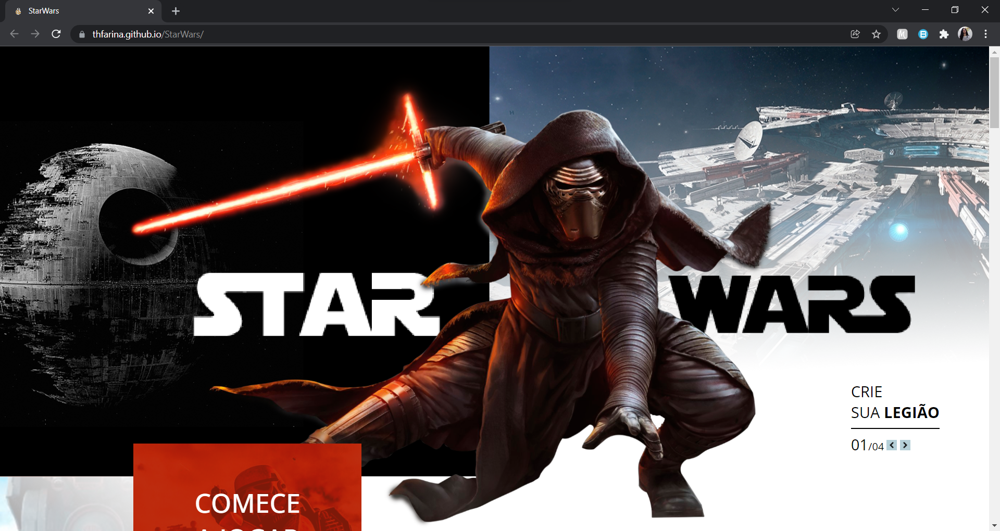
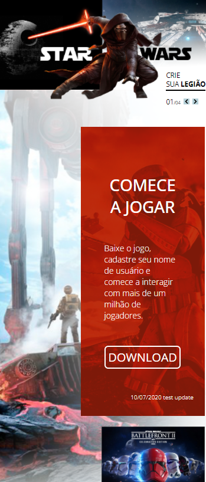

### StarWars project
<h5>🗒️ DESCRIPTION</h5>

A responsive landing page for educational purpose.

 
<h5>🕐 PROJECT STATUS</h5>
<!-- ☑️ -->

⬛ on going

⬛ finished

☑️ needs some bug fix

⬛ paused

 
<h5>🌐 LINK TO WEBPAGE</h5>

https://thfarina.github.io/StarWars/

 
<h5>🎨 DESIGN REFERENCE</h5>

https://xd.adobe.com/view/aaf75fc2-eba3-41ec-bc48-de80d0615154-ffa4/

 
<h5>🖼️ SCREENSHOT</h5>

